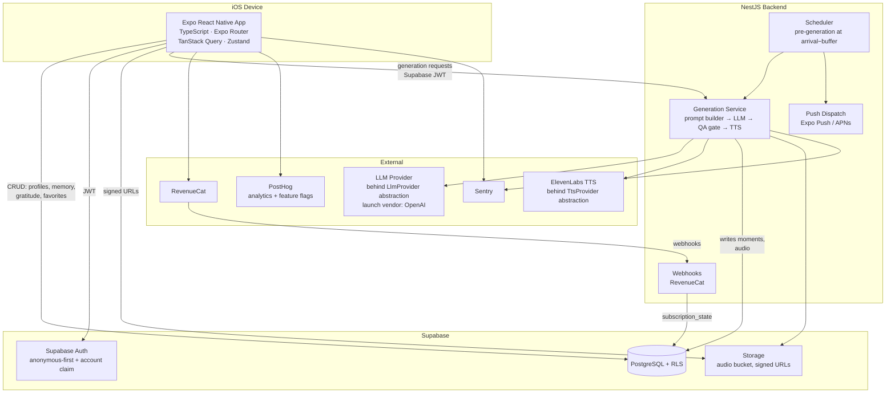

# 00 — TECHNICAL ARCHITECTURE

_Implements the product defined in `/docs/PROJECT-KNOWLEDGE.md` and `/docs/00–20`. This document is the system map; every numbered technical doc drills into one area._

---

## 1. System overview

Aura is an iOS-first React Native (Expo) app backed by **Supabase** (auth, Postgres, storage) and a deliberately **thin NestJS backend** that exists only where a server is mandatory: AI content generation, quality gating, scheduled jobs, webhooks, and push dispatch.

## 2. Core architectural decisions

| #   | Decision                                                                                                                                                        | Rationale                                                                                                                                                                   | Detail |
| --- | --------------------------------------------------------------------------------------------------------------------------------------------------------------- | --------------------------------------------------------------------------------------------------------------------------------------------------------------------------- | ------ |
| D1  | **Thin backend** — mobile ↔ Supabase direct for all CRUD; NestJS only for generation, jobs, webhooks, push                                                      | Less code, less latency, cheaper hosting; RLS is the security boundary; matches founder direction ("backend only for LLM calls")                                            | 04     |
| D2  | **Anonymous-first auth** — full onboarding + Letter without an account; claim at purchase                                                                       | Resolves product Open Question #8; onboarding friction kills the wow funnel                                                                                                 | 03     |
| D3  | **Pre-generation** — daily moments generated by cron at `arrival_time − buffer` (default 30 min)                                                                | Enables arrival notifications that name the moment, <300ms playback start, server-side retry before the user sees anything. Cost guarded by skipping users inactive >7 days | 04, 08 |
| D4  | **LLM provider abstraction, vendor open** — `LlmProvider` interface; launch vendor is an explicit open decision requiring no-training/no-retention terms        | Product doc 20 Q7; avoids lock-in while the voice-quality bake-off happens                                                                                                  | 08     |
| D5  | **ElevenLabs TTS** behind `TtsProvider`                                                                                                                         | Warm voice quality is the product; word-level timestamps drive karaoke sync                                                                                                 | 10     |
| D6  | **RevenueCat** for subscriptions — dual SKU (annual $39.99 pre-selected, weekly $6.99 + 7-day trial), webhooks as revenue source of truth                       | Product doc 15; cohort truth from day one                                                                                                                                   | 12     |
| D7  | **PostHog** for analytics + experiments                                                                                                                         | Events, funnels, and A/B flags (`exp_trial_variant`, `exp_paywall_hero`, `exp_ondemand_limit`) in one tool                                                                  | 13     |
| D8  | **Monorepo** — pnpm workspaces + Turborepo: `apps/mobile`, `apps/backend`, `packages/shared`, `supabase/`                                                       | Shared zod contracts + event types between mobile and backend; single CI                                                                                                    | 01     |
| D9  | **Memory v1 is structured, not vector** — profile + tagged memory items + exact-phrase list; no embeddings/RAG                                                  | Product doc 10 explicitly guards against over-engineering; behaviors > retrieval tech                                                                                       | 09     |
| D10 | **Privacy as architecture** — RLS everywhere, free text never in analytics, Never-Include enforced pre- and post-generation, delete = full wipe including audio | Product docs 10, 18: trust is the positioning                                                                                                                               | 14     |

## 3. Responsibility matrix

| Concern                                                                         | Owner                                          | Notes                                              |
| ------------------------------------------------------------------------------- | ---------------------------------------------- | -------------------------------------------------- |
| Auth sessions, JWT                                                              | Supabase Auth                                  | Backend verifies the same JWT (guard)              |
| Profile, memory, people, gratitude, favorites CRUD                              | Mobile ↔ Supabase (RLS)                        | No backend hop                                     |
| Letter / moment / affirmation generation                                        | NestJS                                         | Only path that touches LLM/TTS keys                |
| Generation QA (tokens, banned phrases, Never-Include, length)                   | NestJS QA gate                                 | Release-blocking rules from product docs 08, 14    |
| Crisis-language check                                                           | NestJS (pre-generation step)                   | Product doc 18                                     |
| Audio files                                                                     | Supabase Storage                               | Written by backend, read by mobile via signed URLs |
| Daily pre-generation, D7 milestone, trial reminders, win-back note, auto-soften | NestJS cron                                    | 04, 11                                             |
| Push tokens                                                                     | Supabase table (mobile writes)                 | Backend reads to send                              |
| Purchases, entitlements                                                         | RevenueCat SDK (mobile) + webhooks (backend)   | `subscription_state` mirrored in Postgres          |
| Events, flags                                                                   | PostHog SDK (mobile) + server events (backend) | Typed catalog in `packages/shared`                 |
| Crash/error reporting                                                           | Sentry (both apps)                             | Generation-failure alarms                          |

## 4. Primary data flows

### 4.1 Session 1: install → Letter → paywall

1. App boots → Supabase **anonymous sign-in** → `profiles` row created.
2. Onboarding answers cached locally (Zustand + MMKV draft) and written to `onboarding_answers` + seeded into `memory_items` / `exact_phrases` as each screen completes.
3. S11 done → mobile calls `POST /v1/generation/letter` → backend assembles memory context → LLM → QA gate → ElevenLabs TTS → audio + word timings stored → `moments` row (`type: letter`, `status: ready`).
4. Mobile polls `GET /v1/generation/jobs/:id` (or Supabase Realtime on the row) while the ritual screen plays; on ready, plays letter with karaoke sync.
5. Continue → paywall (RevenueCat offering). Purchase → anonymous account **claim** (Sign in with Apple / email) → RevenueCat webhook → `subscription_state`.

### 4.2 Daily ritual (steady state)

1. Cron (backend): for each user active ≤7 days ago with `arrival_time` in the next window → enqueue generation job → moment ready → push notification in companion voice.
2. User taps notification → deep link → player (audio pre-buffered, <300ms start).
3. Post-moment flow → affirmation reveal → gratitude line (local-first write, background sync to Supabase) → done-state + countdown.
4. Every input (gratitude, refine, manifest text, profile edit) writes `memory_items`; tomorrow's generation reads them.

### 4.3 Purchase & entitlement flow

Mobile RevenueCat SDK → StoreKit → RevenueCat backend → webhook → NestJS → `subscription_state` upsert → mobile reads entitlement from RevenueCat SDK (source of truth for gating) with Postgres mirror for backend decisions (e.g., Manifest Anything credit checks).

## 5. Environments

| Env          | Supabase              | Backend                                | Mobile                                     | Purpose               |
| ------------ | --------------------- | -------------------------------------- | ------------------------------------------ | --------------------- |
| `local`      | Supabase CLI (Docker) | `pnpm dev` local NestJS                | Expo dev client, simulator                 | Development           |
| `staging`    | Dedicated project     | Hosted (Railway/Fly), staging env vars | TestFlight internal, EAS `staging` profile | QA, sandbox purchases |
| `production` | Dedicated project     | Hosted, prod secrets                   | App Store, EAS `production` profile        | Live                  |

Full deployment detail → 16.

## 6. Vendor matrix

| Vendor               | Role                                                               | Contract requirement (product doc 18)                                                                                                                 | Status                               |
| -------------------- | ------------------------------------------------------------------ | ----------------------------------------------------------------------------------------------------------------------------------------------------- | ------------------------------------ |
| Supabase             | Auth, Postgres, Storage                                            | SOC2; RLS enforced                                                                                                                                    | Locked                               |
| OpenAI (ChatGPT API) | Text generation (launch default, behind `LlmProvider` abstraction) | **No-training / no-retention API terms mandatory** (zero-retention via API data controls — verify at account setup); latency <40s letter, <20s moment | Locked (founder decision 2026-07-17) |
| ElevenLabs           | TTS                                                                | No-retention terms; word timestamps                                                                                                                   | Locked (behind abstraction)          |
| RevenueCat           | Subscriptions                                                      | —                                                                                                                                                     | Locked                               |
| PostHog              | Analytics + flags                                                  | No free-text content ever sent (enforced by typed events)                                                                                             | Locked                               |
| Sentry               | Errors                                                             | PII scrubbing on                                                                                                                                      | Locked                               |
| Expo (EAS)           | Build, submit, push                                                | —                                                                                                                                                     | Locked                               |

## 7. Resolution of product Open Questions (doc 20) — technical items

| Q                                                       | Resolution                                                                                                                                                                                                                                              |
| ------------------------------------------------------- | ------------------------------------------------------------------------------------------------------------------------------------------------------------------------------------------------------------------------------------------------------- |
| Q5 Generation scheduling                                | **Pre-generate at arrival−buffer** (D3), validated with founder                                                                                                                                                                                         |
| Q6 Crisis detection                                     | Layered: keyword screen (fast, local to backend) + LLM classifier confirm; region resource list; spec in 14                                                                                                                                             |
| Q7 LLM/TTS vendors                                      | TTS = ElevenLabs; LLM = abstraction now, vendor bake-off before Phase 5 (08 §2 gives the evaluation rubric)                                                                                                                                             |
| Q8 Anonymous auth                                       | Anonymous-first with claim-at-purchase (D2); full flow incl. restore edge cases in 03                                                                                                                                                                   |
| Q1 Brand name                                           | **Decided: "Aura: Manifest Daily"** (founder, 2026-07-17). Display name + App Store/ASO title; companion still speaks as "Aura". Set in `app.config.ts` at Phase 0 (bundle id e.g. `com.aura.manifestdaily` — confirm exact reverse-domain at Phase 0). |
| Q2–Q4 (voice identity, pricing final, on-demand limits) | Product decisions — carried as config, not architecture: TTS voice id, SKU ids, and limits are env/remote config                                                                                                                                        |

## 8. Non-functional requirements (release-blocking)

- **Performance:** 60fps animations (Reanimated on UI thread); audio start <300ms for pre-buffered daily moment; skeleton→content <1.5s p75; letter generation end-to-end <40s p90.
- **Reliability:** generation jobs retried server-side (max 2) before user-visible failure; graceful in-voice error copy always (never codes — product doc 14).
- **Security:** RLS on every user table; secrets server-side only; signed expiring audio URLs; JWT verification on every backend route (14).
- **Privacy:** no free text in analytics; sensitive-tier memory never in notifications/shares/titles; delete = full wipe within stated window (14).
- **Accessibility:** VoiceOver labels, Dynamic Type with clamps, Reduce Motion crossfade fallbacks (05).
- **Cost guardrails:** one-a-day pacing, 1 refine/moment, 3 Manifest Anything/week, audio caching, pre-generation skip for inactive users (08 §7).

## 9. Document map

| Doc                 | Area                 | Implements product docs |
| ------------------- | -------------------- | ----------------------- |
| 01                  | Repository structure | —                       |
| 02                  | Database schema      | 05, 09, 10              |
| 03                  | Auth                 | 07, 20-Q8               |
| 04                  | Backend              | 05, 08, 15              |
| 05                  | Mobile               | 11, 12, 13              |
| 06                  | Navigation           | 11                      |
| 07                  | API contracts        | 08, 09                  |
| 08                  | AI architecture      | 08, 14, 18              |
| 09                  | Memory               | 10, 16                  |
| 10                  | Audio & TTS          | 08, 09, 12              |
| 11                  | Notifications        | 09, 16                  |
| 12                  | Subscriptions        | 15                      |
| 13                  | Analytics            | 17                      |
| 14                  | Security & privacy   | 18                      |
| 15                  | Testing              | all                     |
| 16                  | Deployment           | —                       |
| IMPLEMENTATION-PLAN | Phases 0–12          | all                     |
