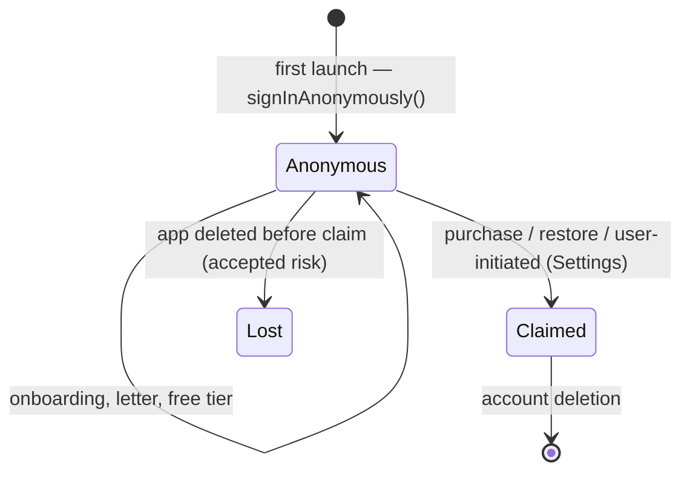

# 03 — AUTH ARCHITECTURE

_Supabase Auth, anonymous-first. Resolves product doc 20 Open Question #8. Implements the friction rule from product doc 07: no email asked at onboarding._

---

## 1. Principles

1. **Zero auth friction before the wow.** The user reaches the Letter without ever seeing an auth screen.
2. **An account exists from second one.** Anonymous Supabase sessions are real users: real `user_id`, real rows, real RLS. "Claiming" only attaches a credential.
3. **Purchase forces durability.** Money must never be attached to an unrecoverable identity.

## 2. Lifecycle

### 2.1 First launch

- App boot → no stored session → `supabase.auth.signInAnonymously()`.
- DB trigger creates `profiles` row; `is_anonymous = true`.
- Session persisted in secure storage (Keychain via expo-secure-store adapter for the Supabase client).
- PostHog identified with `user_id` (pseudonymous — 13 §2).

### 2.2 Claiming (anonymous → durable)

Triggered at: purchase confirmation (mandatory), restore purchases (mandatory), or voluntarily from Settings ("Keep your letters safe on a new phone").

Mechanism — Supabase identity linking on the _same_ user (no data migration ever needed):

- **Sign in with Apple** (primary, required by App Store when offering third-party login; also the lowest-friction option): `linkIdentity({ provider: 'apple' })`.
- **Email magic link / OTP** (fallback): `updateUser({ email })` → verify → linked.
- On success: `profiles.is_anonymous = false`. Same `user_id`, all rows untouched.

Copy stays in-voice ("So your letters are never lost — sign in once."). Claim UI is a sheet, never a full-screen wall.

### 2.3 Edge cases (the ones that bite)

| Case                                                                       | Handling                                                                                                                                                                                                                                                                                                                                                                                                                                                                           |
| -------------------------------------------------------------------------- | ---------------------------------------------------------------------------------------------------------------------------------------------------------------------------------------------------------------------------------------------------------------------------------------------------------------------------------------------------------------------------------------------------------------------------------------------------------------------------------- |
| **Purchase completes but claim abandoned** (user kills app on Apple sheet) | Purchase is already bound to RevenueCat `app_user_id` = Supabase `user_id`. On next launch, claim sheet re-presents (blocking banner on Home, dismissible once per session). Entitlement works meanwhile — never hold paid features hostage to claiming.                                                                                                                                                                                                                           |
| **Restore on a new device, never claimed**                                 | Old anonymous identity is unrecoverable. RevenueCat `restorePurchases()` finds the App Store receipt → transfers entitlement to the _new_ `app_user_id` (RevenueCat transfer behavior: "transfer to new app user id"). New profile starts empty; onboarding runs again. Honest copy: entitlement restored, content can't be ("Your subscription is back. Your letters lived on your old phone — let's write new ones."). This is why claim-at-purchase is mandatory going forward. |
| **Restore on new device, previously claimed**                              | Sign in (Apple/email) first → same `user_id` → data AND entitlement present. Restore button also available pre-sign-in; if receipt maps to a claimed RC user, prompt sign-in instead of transferring.                                                                                                                                                                                                                                                                              |
| **Apple credential revoked** (Settings → Apple ID)                         | Supabase identity remains; email identity (if linked) still works; else user can re-link on next sign-in prompt.                                                                                                                                                                                                                                                                                                                                                                   |
| **Two devices, same claimed account**                                      | Supported naturally (sessions per device). Pre-generation cron keys off user, not device; push goes to all active tokens.                                                                                                                                                                                                                                                                                                                                                          |
| **Anonymous user deletes app**                                             | Data orphaned. Sweep job: anonymous users with `last_active_at > 90 days` are hard-deleted (14 §6) — privacy win + storage hygiene.                                                                                                                                                                                                                                                                                                                                                |
| **JWT expiry mid-session**                                                 | Supabase client auto-refreshes; backend guard returns 401 → mobile api client retries once after refresh.                                                                                                                                                                                                                                                                                                                                                                          |

## 3. Token flow (mobile ↔ backend)

- Mobile sends `Authorization: Bearer <supabase_access_token>` on every backend call.
- NestJS `SupabaseAuthGuard`: verifies JWT signature against the project JWT secret (HS256) or JWKS (if asymmetric keys enabled — preferred, no shared secret), extracts `sub` → `request.userId`.
- Backend **never** accepts a client-supplied user id; every query is scoped by the verified `sub`.
- Service-role key is used only for pipeline writes; user-scoped reads in backend use the verified id explicitly (no impersonation tokens needed).

## 4. RevenueCat identity binding (detail in 12)

- `Purchases.logIn(supabase_user_id)` at app boot (after session exists) — RC `app_user_id` ≡ Supabase `user_id` always, anonymous or claimed. Claiming does not change the id, so no RC aliasing complexity.
- Webhooks therefore arrive with `app_user_id = user_id` → direct `subscription_state` upsert.

## 5. Deletion (product doc 18 §4)

Settings → Delete account & data → typed confirmation → `POST /v1/account/delete` (backend):

1. Delete Storage objects under `audio/{user_id}/`.
2. `auth.admin.deleteUser(user_id)` → cascades all tables (02 §8).
3. RevenueCat `DELETE /subscribers/{user_id}` (removes RC data; App Store subscription itself must be cancelled by the user — the confirmation screen says this plainly with a link to `manage subscriptions`).
4. PostHog person deletion request.
5. Local: sign out, wipe MMKV caches + audio cache.
   Response returns only after 1–2 complete; 3–4 are queued with retry. Stated window in privacy policy: 30 days for all downstream systems.

## 6. Sessions & security posture

- Access token TTL: Supabase default (1h) with refresh rotation; refresh token reuse detection on (Supabase default).
- No passwords at V1 (Apple + magic link only) — nothing to breach, nothing to reset.
- Deep links for magic links: `aura://auth/callback` registered in `app.config.ts`; Expo Router handles the callback route (06).
- Anonymous sign-in abuse: Supabase anonymous rate limits + Turnstile-free (mobile-only app; App Attest can be added if abuse appears — deferred, noted in 14 §8).

## 7. Phase mapping

- **Phase 2** builds: anonymous boot, session persistence, profiles trigger, backend guard, deletion primitive.
- **Phase 10** builds: claim-at-purchase sheet, restore flows, RC binding edge cases.
- Voluntary claim from Settings ships with Phase 10 (same sheet, second entry point).
