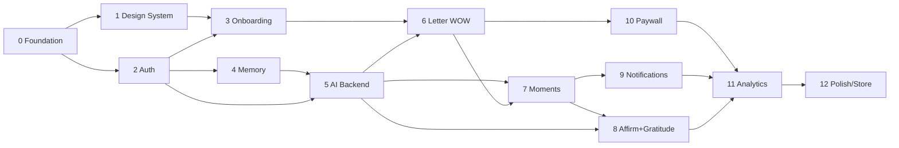

# IMPLEMENTATION PLAN

_Phased build plan for Aura V1. Each phase is sized for independent implementation by Claude Code. Statuses are updated as phases complete. Before implementing any phase: read PROJECT-KNOWLEDGE.md, this plan, the phase's referenced docs, and inspect the existing codebase. Never start the next phase without explicit approval._

**Status legend:** ⬜ not started · 🟨 in progress · ✅ done

| #   | Phase                                     | Status |
| --- | ----------------------------------------- | ------ |
| 0   | Repository & Development Foundation       | ✅     |
| 1   | Design System & Mobile Foundation         | 🟨     |
| 2   | Supabase Auth & User Foundation           | ✅     |
| 3   | Onboarding — "The Conversation"           | 🟨     |
| 4   | Living Memory & Profile                   | 🟨     |
| 5   | AI Generation Backend                     | 🟨     |
| 6   | Future-Self Letter — WOW                  | 🟨     |
| 7   | Daily Moments & Audio Player              | 🟨     |
| 8   | Affirmations & Gratitude                  | 🟨     |
| 9   | Notifications & Daily Habit Loop          | ⬜     |
| 10  | Subscriptions & Paywall                   | 🟨     |
| 11  | Analytics & Experimentation               | ⬜     |
| 12  | Polish, Performance & App Store Readiness | ⬜     |

## Dependency graph

## Recommended execution order

**0 → 1 → 2 → 3 → 4 → 5 → 6 → 10 → 7 → 8 → 9 → 11 → 12**

Rationale: Phase 10 (paywall) is pulled forward right after the Letter because the session-1 funnel (install → wow → paywall) is the product's north star — building it early lets TestFlight cohorts exercise the real conversion path and de-risks the anonymous-purchase→claim flow (the highest-risk integration, per Stella's review history) while retention features are still being built. Phases 7 and 10 are independent and can proceed in parallel if capacity allows.

---

## Phase 0 — Repository & Development Foundation

- **Objective:** Working monorepo with all three workspaces building, linting, testing in CI; local Supabase; skeleton apps boot.
- **User outcome:** None user-visible; every later phase moves faster and safer.
- **Dependencies:** None.
- **Backend tasks:** NestJS skeleton (`app.module`, config with zod-validated env, `HealthModule` with `/v1/health`, Sentry init, pino logging); `mock` LLM/TTS provider stubs registered.
- **Mobile tasks:** Expo app init (TS strict, dev client, expo-router skeleton with placeholder tabs), EAS project + `eas.json` profiles, Sentry init, MMKV + supabase client wiring stubs, path aliases.
- **Database changes:** `supabase init` + config; empty migration baseline; type-generation script.
- **API endpoints:** `GET /v1/health`.
- **External integrations:** Sentry (both), EAS, GitHub Actions CI (`lint`/`typecheck`/`test`/build via Turborepo), husky + lint-staged.
- **Analytics events:** None (PostHog wrapper stub created in `packages/shared` events scaffold).
- **Tests:** CI green: unit test harness runs in all 3 workspaces (one trivial test each); health e2e (supertest).
- **Edge cases:** Node/pnpm versions pinned; `.env.example` complete; fresh-clone bootstrap documented in README (one command to running local stack).
- **Definition of Done:** Fresh clone → `pnpm i && pnpm dev` runs backend + local Supabase; Expo dev client builds and boots on simulator; CI passes; `01-REPOSITORY-STRUCTURE.md` matches reality.

### Phase 0 — as built (2026-07-17)

Versions: Expo SDK 57.0.7 · React Native 0.86 · NestJS 11 · Node 22.12.0 · pnpm 10.4.1 · Turborepo 2 · TypeScript 5.9.

Decisions taken during implementation (each already reflected in the docs it touches):

1. **Bundle id `com.aura.manifestdaily`** (founder, 2026-07-17). Variant suffixes `.dev`/`.staging` let all three builds coexist on one device. Brand stays isolated to `app.config.ts`.
2. **`@aura/shared` is a compiled package**, and generated DB types live in `packages/shared/src/types/database.types.ts` rather than `supabase/types/` — `tsc`'s `rootDir` rejects cross-package source imports, so anything shared re-exports must sit inside its own tree. 01 §4/§5 updated.
3. **TypeScript pinned to 5.9 monorepo-wide**, excluded from Expo's version check. Expo SDK 57 suggests TS 6, but `ts-jest@29` declares peer `>=4.3 <6` and `@nestjs/cli@11` pins 5.7.3 — one TS across all workspaces beats matching the suggestion. Revisit when ts-jest supports TS 6.
4. **Health probes are real, not stubbed.** `db`/`storage` hit Supabase over HTTP since `SupabaseModule` doesn't exist until Phase 2. **Phase 2 should swap them for the injected service-role client** (a real query beats a gateway 200) and must mark `/v1/health` public when the global auth guard lands — otherwise the host health check reads 401 as "down".
5. **Anonymous sign-in + manual linking enabled** in `supabase/config.toml` now (00 §D2, 03 §2.2) so the auth model is identical in every environment from day one.

Known gaps, deliberately deferred:

- **EAS project not initialised** — `eas.json` profiles exist but `eas init` needs the founder's Expo account; `extra.eas.projectId` reads from `EAS_PROJECT_ID`. `submit.production` carries `TODO_PHASE_10` placeholders (needs App Store Connect).
- **`migrate-staging.yml` / `release.yml` not written** (01 §7) — they need real staging/production projects; they belong with Phase 12 deployment.
- **Simulator boot unverified** — built on Linux, so `expo run:ios` was never executed. The iOS bundle exports cleanly (Hermes, 3.8MB), which proves the module graph resolves, but _founder must confirm the dev client boots on a simulator_ to close the DoD.
- No app icon or splash asset yet (Phase 12).

## Phase 1 — Design System & Mobile Foundation

- **Objective:** Token system, core components, the Orb, tab shell, sheets, haptics/motion utilities — the visual language of product docs 12/13 as code.
- **User outcome:** App feels calm-premium from the first screen ever built on it.
- **Dependencies:** 0.
- **Backend tasks:** None.
- **Mobile tasks:** `src/theme` tokens (colors incl. dark scheme, serif+sans typography with Dynamic Type clamps, 8pt spacing, radii); components: `Screen` (gradient), `Card` (solid/glassy), `PillButton`, `TextButton`, `Chip`, `SelectCard`, `Input`, `Sheet` (gorhom wrapper w/ detents), `TabBar` (floating pill), `Label`, `SerifDisplay`, `CountdownChip`, `WeekDots`, `Skeleton`, `EmptyState`; **Orb** (Skia + Reanimated: idle/listening/generating/speaking states, Reduce Motion fallback); haptics util implementing product-13 table with guards; motion helpers (`fadeRise`, `chipSelect`, `crossfade`, `MotionContext`); `src/copy` catalog structure with initial strings; bundled fonts.
- **Database changes:** None.
- **API endpoints:** None.
- **External integrations:** Skia, Reanimated, gorhom/bottom-sheet, expo-haptics.
- **Analytics events:** None.
- **Tests:** RTL renders for each component (incl. Dynamic Type reflow breakpoint); haptics guard unit tests (≤2/screen dev warning, 500ms spacing); copy-lint script scaffold (banned phrases).
- **Edge cases:** Reduce Motion on every animation; dark mode on every component; fontScale >1.3 chip→list reflow.
- **Definition of Done:** Storybook-style gallery screen shows all components in light/dark; Orb runs 60fps on iPhone 12-class device in all 4 states; founder eyeballs "calm is the brand" on device.

### Phase 1 — as built (2026-07-17) — 🟨 code-complete, device sign-off pending

Everything verifiable off-device is done and green; the two DoD items that require an iPhone (60fps orb, "calm is the brand") are the founder's checklist below.

**Built:**

- `src/theme`: palette (raw values live ONLY there), semantic tokens per scheme, 8pt spacing, radii, durations; serif (bundled Fraunces) + sans typography with Dynamic Type clamps (serif clamps 0.85–1.4 so Letter karaoke survives accessibility sizes; UI sans scales freely); chip→list reflow breakpoint at fontScale 1.3; `ThemeProvider`/`useTheme` (throws outside provider — an unthemed screen must fail loudly).
- Haptics (product-13 table, complete): typed `HapticEvent` union with **no `error` and no `paywall` member — the banned haptics are unrepresentable**, not just discouraged; 500ms min interval; ≤2/screen dev warning; system-setting kill switch. 13 guard tests.
- Motion: `fadeRise`, `chipSelectScale`, `crossfade`, `sheetSpring`, `MotionProvider` (+`LetterMotionProvider` at 1.2×); Reduce Motion collapses everything to crossfades and reacts to mid-session toggles.
- 16 components, RTL-tested: Screen (gradient), Card (solid/glassy), PillButton, TextButton, Chip, SelectCard, Input, Sheet (gorhom v5, medium/large detents, 40% dim), TabBar (floating pill, active periwinkle), Label, SerifDisplay, CountdownChip (minute tick, no seconds, no animation), WeekDots (no missed-day state exists — shame-free by construction), Skeleton, EmptyState, **Orb** (Skia: 4 states, breath/glow/shimmer on shared values only, halo overscan, hidden from VoiceOver as presence-not-information).
- Copy lint wired as a jest suite over `src/copy/**`: banned phrases + guilt vocabulary (lists live in `@aura/shared` so the Phase 5 QA gate reads the same ones), exclamation budget, "the user" ban, error-code ban.
- ESLint rule: raw hex in feature code is an error; `src/theme/` exempt.
- Root layout: Fraunces held behind the splash (font failure falls back rather than bricking launch), ThemeProvider → MotionProvider → QueryClient → BottomSheetModalProvider → BootGate; GestureHandlerRootView at top. Tab shell uses the pill TabBar.
- Gallery at `/gallery` (dev-only route): all components, light and dark stacked, orb state switcher.

**Decisions:**

1. **Chip press scale is an acknowledgment, not a state** — tying 0.97 to `selected` left chosen chips permanently shrunken. Selection's lasting signal is the fill tint.
2. **Skia pinned to 2.6.2** (Expo SDK 57's expectation, expo-doctor 20/20) — a newer JS lib against the dev client's pinned native module is a runtime mismatch on device.
3. Jest stack for the animation libs: reanimated's official mock + `react-native-worklets/jest/resolver` + Skia's `jestSetup`; pnpm needs `@scope+pkg` spellings in `transformIgnorePatterns` alongside `@scope/pkg`.
4. TabBar types a **local structural subset** of `BottomTabBarProps` — the real type isn't importable under pnpm strict node_modules (transitive dep); stays assignable at the `tabBar=` call site.

**Founder device checklist (closes this phase):**

- [ ] `pnpm exec expo run:ios`, open `aura://gallery` (or /gallery from the dev menu)
- [ ] Orb: all 4 states at 60fps (Perf monitor), iPhone 12-class
- [ ] Light + dark both read as "calm is the brand"; nothing shouts
- [ ] Dynamic Type at max accessibility size: serif clamps, chips reflow to lists
- [ ] Reduce Motion on: everything crossfades, orb stills
- [ ] Haptics: button press, chip select — punctuation, not decoration
- [ ] Sheet detents (medium/large), grabber, 40% dim
- [ ] Boot: fresh install → anonymous session + profile row; kill/relaunch keeps session (Phase 2's carry-over items)

## Phase 2 — Supabase Auth & User Foundation

- **Objective:** Anonymous-first identity, profiles, RLS baseline, boot gating, analytics identity, deletion primitive.
- **User outcome:** Invisible — the app just works on first open with no signup.
- **Dependencies:** 0.
- **Backend tasks:** `SupabaseAuthGuard` (JWT verify → userId); `SupabaseModule` (service-role client); `POST /v1/account/delete` (Storage wipe + `auth.admin.deleteUser`; RC/PostHog deletion queued as no-ops until those phases).
- **Mobile tasks:** Supabase client with secure-store session persistence; boot sequence (05 §9): anon sign-in, hydrate, route gate skeleton (onboarding-incomplete → onboarding placeholder); `useProfile` hook; PostHog init + `identify`; analytics wrapper with first events.
- **Database changes:** Migration: `profiles` (+ creation trigger on auth.users), `onboarding_answers`; RLS baseline policies; indexes.
- **API endpoints:** `POST /v1/account/delete`.
- **External integrations:** PostHog SDKs (mobile identify + backend module stub).
- **Analytics events:** `app_first_open`, `app_open {source}`.
- **Tests:** RLS suite for `profiles`/`onboarding_answers` (the pattern all tables follow); guard unit tests (valid/expired/garbage JWT); boot-flow hook tests; deletion e2e (rows + auth user gone).
- **Edge cases:** Token refresh + 401-retry in api client; offline first-launch (retry anon sign-in with backoff, honest waiting state); clock skew.
- **Definition of Done:** Fresh install → anonymous user + profile row exist; kill/relaunch keeps session; deletion wipes and returns to fresh state; RLS tests green in CI.

### Phase 2 — as built (2026-07-17)

Built before Phase 1 (founder call): Phase 2 depends only on Phase 0, and its work is verifiable against a real database, whereas Phase 1 is on-device visual work that the Linux dev machine cannot check.

Decisions and findings:

1. **GRANTs are part of the RLS baseline.** Policies alone deny everything — the `authenticated` role also needs table privileges. The RLS suite caught this (`42501 permission denied`) before it could block Phase 3. **Every later table migration must include both**, or nothing works. `anon` is granted nothing: anonymous _sign-in_ users carry role `authenticated`, so `anon` means no JWT at all.
2. **JWT verification is asymmetric (ES256 via JWKS).** Local Supabase issues ES256 tokens and serves `/auth/v1/.well-known/jwks.json`, so 03 §3's preferred "no shared secret" path is the one implemented. `jose` caches keys and refetches only on an unseen `kid` — no per-request round-trip, survives rotation.
3. **jose pinned to 5.x.** jose 6 is ESM-only and cannot be `require`d by the CommonJS NestJS/Jest setup. The JWKS resolver is an injected provider (`JWKS_RESOLVER`) rather than constructed inside the guard, so tests supply a local key set and still exercise real signature verification.
4. **Auth is global and opt-out** (`@Public()`), not opt-in. Forgetting a guard on a generation endpoint would expose memory; forgetting `@Public()` only breaks that route loudly. `/v1/health` is `@Public()` — an e2e test pins this, since a 401 there makes the load balancer pull the instance.
5. **Deletion is idempotent.** A retry after deletion returns 204: the JWT still verifies for its remaining lifetime, and the desired state already holds. Storage is wiped _before_ `deleteUser`, because Postgres cascades rows but cannot reach Storage — deleting the user first orphans the audio with no owner left to identify it.
6. **`values ≤ 2` is a DB check constraint**, not just UI validation (product 07 S6).
7. **`test:live`** is the Docker-dependent suite (RLS + deletion e2e); `test` stays Docker-free. CI runs both, and the live job also verifies the committed `database.types.ts` matches the migrations.

Verified: 61 tests green — 20 against a live Supabase, including that Alice's unfiltered `select *` cannot surface Bob's struggle text, that a forged `user_id` insert is rejected, that a wrong-key/wrong-issuer JWT is refused, and that deletion actually removes the auth user and cascades the rows.

Known gaps, deliberately deferred:

- **PostHog is a no-op without a key** (16 §1: disabled locally). `identify` + `app_first_open`/`app_open` are wired and unit-tested, but no event has been observed landing in a real PostHog project — needs a staging key.
- **RevenueCat and PostHog person-deletion** (steps 3–4 of the 03 §5 runbook) are intentionally absent until Phases 10/11 own those integrations.
- **Boot sequence unverified on device** — same Linux limitation. `useBoot`, `ensureSession` retry/backoff, the route gate and the first-open flag are unit-tested and the app bundles, but "fresh install → anonymous user + profile row" and "kill/relaunch keeps session" are _founder sign-off items_ on a simulator.
- `BootGate` copy is placeholder; Phase 1 replaces it with the orb + `src/copy/` in-voice lines.

## Phase 3 — Onboarding — "The Conversation"

- **Objective:** S1–S11 per product doc 07: one question per screen, reflections, edit-guard, resume, skip rules — writing profile + answer log.
- **User outcome:** A 4–5 minute conversation that feels like being listened to, ending ready for the Letter.
- **Dependencies:** 1, 2.
- **Backend tasks:** None (answers go mobile→Supabase; crisis check on S10 happens in Phase 5 when the safety service exists — until then S10 stores verbatim only; flag noted for Phase 5 to backfill the check into the letter call path).
- **Mobile tasks:** `(onboarding)` stack: S1 welcome (price-honesty line — config value), S2 meet-Aura (typing dots), S3 name, S4 self-description + reflection echo, S5 work chips, S6 values multi≤2, S7 dream-home cards (8 illustrations), S8 dream city + reflection, S9 people (add 2–3, "Just me for now" path), S10 struggle (gentle reflection; skippable "Not today"), S11 arrival time; draft store (Zustand+MMKV) with resume; edit-guard sheet; transitions 350ms push+crossfade; keyboard-floating Continue; per-answer commit to `onboarding_answers` + profile fields; timezone capture.
- **Database changes:** Migration: `people` + RLS.
- **API endpoints:** None.
- **External integrations:** None.
- **Analytics events:** `onboarding_started`, `onboarding_screen_viewed`, `onboarding_answer_submitted {screen_id, answer_type, skipped, char_count_bucket}`, `onboarding_completed {duration_s, questions_answered}`.
- **Tests:** RTL per screen (input/skip/reflection states); draft-resume unit tests; edit-guard flow test; Maestro: full flow incl. kill-and-resume, edit an earlier answer, skip S10.
- **Edge cases:** App killed mid-flow → exact-screen resume; offline → answers cached, sync on reconnect with honest copy; emoji/very-long name gentle trim; empty free-text nudge ("even one word helps me"); VoiceOver labels; Dynamic Type chips→list.
- **Definition of Done:** Full conversation runs on device matching product 07 screen specs (copy, animation, haptics); data lands correctly in `profiles`/`onboarding_answers`/`people`; completion event fires with correct duration; founder walkthrough sign-off on feel.

### Phase 3 — as built (2026-07-17) — 🟨 code-complete, device walkthrough pending

**Built:** `people` migration (+GRANTs+RLS, 6 live tests); S1–S11 as thin routes over feature screens sharing one `ConversationScreen` shell + `useConversation` hook; MMKV-persisted draft store (exact-screen resume, never rewinds past where she parked, skips count as answered); edit-guard sheet (revise-never-restart, nested edits keep the original return point); reflection beats (600ms typing dots, soft tick, Reduce Motion keeps the pause but drops the dots); commit path writing every answer to BOTH `onboarding_answers` (audit) and the working copy (profile/people), offline answers queued and drained; completion stamps `onboarding_completed_at` + timezone, seeds Living Memory via Phase 4's `seedMemoryForUser`, fires `onboarding_completed`; funnel events in the typed catalog (free text traced only as `char_count_bucket`).

**Decisions / deviations:**

1. **"Restore purchase" absent from S1** rather than inert — a dead button is dishonest; it lands with RevenueCat (Phase 10).
2. **S11 "pick a time" is hour chips**, not a native wheel — a new native module for one screen wasn't worth a dev-client rebuild mid-phase; hour granularity serves the 15-minute cron windows (04 §5). Swappable in Phase 12 without touching the data shape.
3. **S9 people sync is replace-all-mine** — retried/edited submissions can't duplicate her circle; safe while onboarding is the only writer.
4. **S6 at the 2-cap replaces the oldest pick** instead of dead-tapping.
5. RNTL v14 `fireEvent` is async — every state-dependent test awaits it (a sync call passes vacuously; two of ours initially did).
6. S4's echo uses the Phase 4 harvester on-device; nothing distinctive → generic "Noted." (silence over a wrong guess).

**Founder walkthrough checklist:** full conversation on device (copy/animation/haptics feel); kill mid-flow → exact-screen resume; edit an earlier answer via the sheet; skip S10 via "Not today"; rows land in `profiles`/`onboarding_answers`/`people`; memory seed appears in What Aura Knows; airplane-mode answers sync on reconnect. Maestro flows deferred to device availability.

## Phase 4 — Living Memory & Profile

- **Objective:** Memory schema + write paths from onboarding/profile, phrase harvester, "What Aura Knows" transparency screen, Never-Include — the moat's foundation (docs 09-MEMORY, 02).
- **User outcome:** Profile tab shows everything Aura knows, editable, with per-item delete and Never-Include — trust made visible.
- **Dependencies:** 2 (3 provides real data but is not a hard build dependency).
- **Backend tasks:** Phrase harvester (pure function in shared or backend lib); onboarding-seed routine (profile → memory_items + exact_phrases) — runs server-side at letter request time or as mobile-triggered seed on onboarding completion (choose at implementation: seed-on-completion via Supabase direct writes keeps backend out; harvester lives in `packages/shared` so both apps can run it — recommended).
- **Mobile tasks:** Profile tab per product 11 (basics, dream, people, lifestyle tags, free-text note); "What Aura Knows" screen (plain-language list, per-item delete with confirm); Never-Include list UI; edit flows as sheets; "I'll write differently from now on" save copy; memory-contract copy surfaces.
- **Database changes:** Migration: `memory_items`, `exact_phrases`, `never_include` + RLS + indexes; expiry sweep SQL prepared (cron activates Phase 5).
- **API endpoints:** None (all Supabase direct).
- **External integrations:** None.
- **Analytics events:** `memory_item_created {category, source}`, `memory_item_deleted {category}`, `never_include_added`, `what_aura_knows_viewed`.
- **Tests:** Harvester unit tests (fixtures: quotes, proper nouns, distinctive phrases, stopwords); tier/expiry field logic; RLS for the three tables; RTL: What Aura Knows renders/deletes; seed-routine test (onboarding fixture → expected items).
- **Edge cases:** Deleting a person referenced by items (items filtered via `people.active`, 09 §4); empty memory states in-voice; duplicate phrase dedup; sensitive items visually private in the list (no special badge that stigmatizes — same rendering, just never in other surfaces).
- **Definition of Done:** Completing onboarding produces the expected memory seed; What Aura Knows lists it in plain language; deletes are hard deletes; Never-Include persists; events fire.

### Phase 4 — partially built (2026-07-17) — 🟨

Built out of order (founder call) because the memory **data layer** is verifiable against a real database on the Linux dev machine, whereas its **UI surfaces** need the Phase 1 design system. e2e was explicitly descoped by the founder for this phase; the RLS suite was kept — it is release-blocking (15 §6) and this is the phase where the sensitive tier lands.

**Done:**

- `memory_items`, `exact_phrases`, `never_include` — schema + GRANTs + RLS + indexes, incl. the partial index for the expiry sweep. `expire_temporary_memory()` is defined and verified; Phase 5 attaches the pg_cron schedule.
- Phrase harvester + onboarding seed + emotional weight in `@aura/shared` (09 §1/§3) — pure, deterministic, exhaustively unit-tested.
- Memory data access, TanStack Query hooks, optimistic delete, `seedMemoryForUser` write path for Phase 3 to call on completion.
- "What Aura Knows" screen — behaviour and copy only; styling is placeholder.
- Analytics: `memory_item_created`, `memory_item_deleted`, `never_include_added`, `what_aura_knows_viewed`.

**Decisions and findings:**

1. **Two DB invariants the schema now enforces**, rather than trusting callers: a `temporary` item must carry `expires_at` and a non-temporary must not (the tier/expiry pair can't drift), and `emotional_weight` is constrained to 1–5.
2. **`excluded` column added to `memory_items`** — 09 §2 requires a "done/private" flag that 02 §2's table did not list. Distinct from deletion: the row survives, it just stops being spent. 02 §2 updated.
3. **Harvester bug — names sliced in half.** Window scanning produced `"wake up in New"` from `"…in New York someday"`. Echoing a half-name back to her is the worst failure this module has. Fixed by masking quoted spans and proper nouns out of the text before the window scan; regression-tested.
4. **Harvester bug — short names dropped.** A 4-char minimum silently discarded `"Ivy"`, so a user whose daughter is named Ivy would never hear her name echoed — while the Letter's whole promise is naming her people (product 08). Proper nouns now have their own 2-char floor.
5. **Phrase dedupe is an expression index** `(user_id, lower(phrase))`, which PostgREST's `onConflict` cannot name (it takes plain columns only). The seed write path therefore reads existing phrases and filters, rather than upserting — a batch insert would fail wholesale on one repeat, and a retried seed must never cost her the rest of her memory.
6. **Sensitive items render identically to everything else** on What Aura Knows — no badge, no lock, no muted styling. A marker on the one screen she reviews would stigmatize the thing she was bravest to tell us; the tier does its work invisibly in what generation may spend. Pinned by a test comparing rendered styles.

**Not built — deferred, and why:**

- **Profile tab** (basics, dream, people, lifestyle tags, free-text note) and **edit flows as sheets** — need the Phase 1 design system (`Sheet`, `Card`, `SelectCard`) and, for people, the Phase 3 `people` table.
- **Never-Include UI** — hooks and data access exist and are used by nothing yet; the screen needs Phase 1.
- **Inactive-people filtering** (09 §4) — untestable until Phase 3 creates `people`. `memory_items.source_id` is deliberately a plain uuid with no FK, since its targets live in different tables across phases.
- **Profile-edit and gratitude write paths** — those surfaces land in Phases 4-UI/8.
- **e2e** — descoped by the founder for this phase.
- Nothing here is verified on a device.

### Phase 4 — completed off-device (2026-07-17)

The deferred UI landed once Phase 1's design system existed: Profile tab (basics / dream / people / note, edits as sheets showing "I'll write differently from now on" on save), Never-Include screen over the existing hooks, people management (remove = `active=false`, never a delete — the row stays for history, generation stops using it). Profile edits update the matching permanent `memory_items` in place (09 §1) so What Aura Knows never keeps telling her a corrected truth; the free-text note writes an evolving `place_lifestyle` item. Remaining device items fold into the founder checklist: What Aura Knows/Never-Include/Profile walkthrough on device. Status stays 🟨 only for that walkthrough.

## Phase 5 — AI Generation Backend

- **Objective:** The full generation pipeline: providers, memory context assembly, prompt builders, QA gate, crisis detection, TTS, storage, job machine (docs 08, 09 §4–5, 10 §1–3, 04).
- **User outcome:** None directly — Phase 6 makes it visible. (LLM vendor: **OpenAI, decided** — run the model-tier bake-off per 08 §2 at phase start to pin exact model ids.)
- **Dependencies:** 2, 4.
- **Backend tasks:** `LlmProvider` + Anthropic/OpenAI/mock adapters; `TtsProvider` + ElevenLabs/mock adapters (with-timestamps → word timings); `MemoryContextService` (sampler + cadence directives); prompt builders (letter, daily, ondemand, refine, affirmation daily/guided, milestone, winback — templates versioned); `QaService` (all 8 rule sets); `CrisisDetectionService` (keyword list + classifier confirm); `JobsService` (state machine, idempotency, retries, in-process queue); Storage upload; endpoints: `POST /v1/generation/letter`, `GET /v1/generation/jobs/:id`; entitlement/credit guard scaffolding (free until Phase 10).
- **Mobile tasks:** api client for generation endpoints (zod contracts) + job polling hook.
- **Database changes:** Migration: `moments`, `affirmations`, `generation_jobs`, `usage_credits` + RLS (incl. engagement-column policies); `audio` bucket + policies.
- **API endpoints:** `/v1/generation/letter`, `/v1/generation/jobs/:id` (others stubbed 501 until their phases).
- **External integrations:** OpenAI API (staging keys, zero-retention data controls verified), ElevenLabs (staging keys), Supabase Storage.
- **Analytics events:** `letter_generation_started/succeeded {latency_s}/failed {reason}`, `generation_failed`, `generation_qa_flagged {rule}` (backend-emitted).
- **Tests:** THE core suites (15 §2): QA gate exhaustive, prompt builders, memory sampler, crisis screen, job state machine (retry/idempotency), pipeline integration with mocks, golden tests scaffold (20 personas); RLS for new tables.
- **Edge cases:** Provider timeout/500 (retry then fail gracefully); QA double-fail fallback; malformed LLM JSON (defensive parse + one retry); TTS failure after LLM success (retry TTS only); crisis input on letter path (letter generated WITHOUT struggle theme + supportive flag returned); Storage upload failure (job retry).
- **Definition of Done:** `POST /v1/generation/letter` for a seeded test user yields a `ready` moment with QA-passing text, mp3 in Storage, word timings; all required test suites green; latency <40s p90 against real vendors in staging; vendor no-retention terms verified (14 §8 items for LLM/TTS checked).

### Phase 5 — as built (2026-07-18) — 🟨 pipeline proven on mock; unit suites + vendor bake-off pending

Tests were deferred this phase by the founder — the pipeline was proven end-to-end instead by driving it against the live local stack (see below).

**Built:** schema (moments, affirmations, generation_jobs, usage_credits) with the engagement-column GRANT rule (a user can set `favorited_at` but CANNOT overwrite `body` — verified at the DB); private `audio` bucket + its own-folder RLS; the `expire-temporary-memory` pg_cron activated. Fetch-based OpenAI + ElevenLabs adapters (no SDK deps) behind the existing interfaces, per-tier model ids in env (08 §2). `MemoryContextService` (09 §4 sampler: recency×weight×novelty, sensitive only for body artifacts, inactive-people filtered, cadence directives computed here). Eight versioned prompt builders sharing the voice constitution (cache-friendly stable prefix). The 8-rule `QaService` and the two-layer `CrisisDetectionService` (keyword screen → LLM classifier confirm, fail-safe toward support). `JobsService` state machine: in-process concurrency queues (hand-rolled — p-queue is ESM-only, the jose trap again), idempotency, QA-retry (1) vs provider-retry (2s/8s) lanes, boot re-queue of stale `running` jobs. `POST /v1/generation/letter` (one-per-user, 202+job) and `GET /jobs/:id`. Mobile: zod api client + `useGenerationJob` polling hook. Backend AnalyticsModule now emits the generation events.

**Proven end-to-end against the live stack (mock providers):**

- Seeded user → `POST /letter` → job succeeded on attempt 1 → `ready` moment with name-first body, dream city woven in, all 8 QA rules passed, mp3 in Storage, 149 word timings, `qa_report` stamped with prompt version.
- Crisis-on-letter edge: a struggle containing a crisis phrase → letter still generated, `supportive:true`, and the phrase did NOT leak into the body (14 §5, the plan's edge case).

**Two real bugs the live run caught (a unit test written to the same assumption would have missed both):**

1. **QA date-close was too strict** — it checked only the literal last sentence, but product 08's own canonical close ("…on a Friday in July. I remember. Keep going.") puts the date line third-from-last. Now scans the closing region (last 3 sentences).
2. **The mock LLM returned plain text, not JSON** — so the pipeline could never reach `ready` locally, making the whole flow unrunnable and untestable. The mock now harvests the prompt's context tokens and returns QA-passing JSON (its whole purpose under 04 §6).

**Decisions:** LLM interface gained `model` (tier resolution) + `json` (response-format) fields — kept the adapter dumb about tiers. Only the Letter endpoint is live; moment/manifest/refine/affirmation are Phases 7/8 and simply absent (a 404 is honest; a 501 stub would over-promise this controller).

**Not done — deferred:** the core unit suites (QA exhaustive, prompt builders, memory sampler, crisis screen, job state machine, RLS for the 4 new tables, golden 20-persona tests) — 15 §2's highest-value tests, explicitly deferred this phase and owed before this phase is ✅. The OpenAI model-tier bake-off (08 §2) and the vendor no-retention verification (14 §8) are founder/staging items. No real vendor call has been made — only mock.

### Phase 5 — test debt paid (2026-07-20) — still 🟨 on the two vendor gates

The deferred suites landed. Backend unit tests went **18 → 701**; the live RLS suite went **45 → 71**. `pnpm turbo lint typecheck test` and `pnpm test:live` are green. Coverage on `generation/** · memory/** · safety/**` is **99.8% stmts / 91.5% branch / 100% funcs**, clearing 15 §6's 90% bar (excluding `generation.controller.ts`, whose HTTP surface is e2e's job — e2e was out of scope for this pass by founder instruction).

**Suites written:** QA gate exhaustive (69 tests — all 8 rules × pass/fail, every banned phrase and negative-frame marker enumerated from the shared list, word-boundary and regex-escape cases); prompt builders (43 — stable-prefix cache invariant, her-words-present, exclusions restated, cadence directives, per-artifact structure); memory sampler (36 — scoring by ordering, sensitive-tier gating per artifact, query-shape assertions for the DB-enforced filters); crisis screen (37 — both layers, every fail-safe path, and two tests that assert her disclosure never reaches a log line); job state machine (27 — both retry lanes on fake timers, idempotency, crash recovery, queue routing); concurrency queue (7); pipeline integration with mocks (39 — the whole compose, the crisis-on-letter edge, defensive parse, failure classification); golden 20 personas (425 — properties only, never exact text); RLS for the 4 tables + audio bucket (26 live).

**Four real defects the suites caught** (each would have shipped):

1. **Sensitive struggle leaked into `winback` via a cadence directive.** `assemble` correctly nulls `context.struggle` for non-body artifacts, but `cadenceDirectives` read `profile.struggle` straight from the row and pushed it into an `explicit_callback`, which `renderContextBlock` renders verbatim. Winback is the lapsed-user note — precisely the "never notifications" surface 09 §2 forbids. Fixed: the callback is gated on `includeSensitive`.
2. **The affirmation prompt and the QA gate disagreed about "her words."** The builder offered her _values_ as a sufficient anchor, but values are preset S06 chips — the same list for every user — so the gate's verbatim rule (correctly) never counted them. An affirmation that followed the instruction failed `verbatim_tokens` on both attempts and hard-failed the job. Fixed in the prompt (values are template language, not her words); `PROMPT_VERSION` → `2026-07-20.1`.
3. **The mock LLM could never produce a passing `winback`.** It padded to a hardcoded 95-word floor regardless of artifact, and winback's ceiling is 100 — every generation came out at 103 words. Now derives its target from the range the prompt states.
4. **The mock anchored affirmations on unusable phrases** — a negatively-framed phrase ("proof, not vibes") or one far over the 20-word ceiling — producing output the gate must reject. Now picks a usable anchor, as a real model would; the prompt gained matching guidance.

**Known limitation, raised not fixed:** the explicit-callback cadence guard queries for ANY moment in the last 30 days rather than any recent _callback_, so a user who receives moments regularly never becomes eligible. Fixing it properly needs somewhere to record that a callback was spent (a schema decision). A test pins today's behaviour so the change is visible when it lands.

**Still owed before ✅ (both founder/staging, unchanged):** the OpenAI model-tier bake-off (08 §2) and the vendor no-retention verification (14 §8). The DoD's "latency <40s p90 against real vendors in staging" also remains unmeasured — no real vendor call has been made.

## Phase 6 — Future-Self Letter — WOW

- **Objective:** The generation ritual (S12) and the Letter experience exactly per product doc 08 — the emotional peak, pre-paywall.
- **User outcome:** She hears her name, her city, her people, her struggle transformed — "this was made specifically for me."
- **Dependencies:** 3, 5.
- **Backend tasks:** None new (letter endpoint exists).
- **Mobile tasks:** `generating.tsx` ritual (orb slows/deepens, gradient dusk shift, 3 sequenced lines + >45s fourth line, no spinner, gestures disabled, failure → in-voice retry); `/letter` full-screen cover: audio via PlayerService, single haptic at first word + soft tick at date line, karaoke renderer (serif 2–6 words/line, fade+rise, prior lines dim, auto-scroll, no visible controls, back-swipe → Continue-listening sheet); end-state ("Your future self has more to tell you." → Continue); letter auto-favorite + permanent cache; silent-switch/volume pre-check; boot-gate integration (letter-unseen → `/letter`).
- **Database changes:** None.
- **API endpoints:** None new.
- **External integrations:** None new.
- **Analytics events:** `letter_playback_started`, `letter_playback_completed {listened_pct}`.
- **Tests:** Karaoke word-index math unit tests (timings fixtures, drift re-anchor); RTL ritual-screen states; Maestro: onboarding → ritual → letter plays → completion state (mock backend fixture with real timings file).
- **Edge cases:** Generation exceeds 90s (retry copy, never error codes); app backgrounded mid-letter (audio continues, background mode; return restores sync); interruption (call) → pause/resume; letter replay from Home ("kept" state); zero-volume pre-check; Reduce Motion (crossfade lines, orb still).
- **Definition of Done:** End-to-end on device: finish onboarding → ritual → letter with synced karaoke at 60fps, haptics per spec, ends to Continue; letter cached and replayable offline; wow verified by founder ("would this give goosebumps?"); events fire with listened_pct.

### Phase 6 — as built (2026-07-20) — 🟨 code-complete, device pass pending

The whole path is wired: S11 → ritual → Letter → Home, with the boot gate reopening into the Letter if she quits mid-way. Mobile tests went **147 → 257**. `pnpm turbo lint typecheck test` green; `pnpm test:live` still 71.

**Built:** `generating.tsx` ritual (orb `generating`, two stacked gradients cross-fading light→dusk on the UI thread, three sequenced lines accumulating at reading pace, the >45s fourth line, no spinner or percentage anywhere, in-voice retry with no code) · `/letter` full-screen cover under `LetterMotionProvider` (everything inside breathes 20% slower, product 13 §4) · the karaoke renderer (fade+rise per line, prior lines dimming to 60%, self-scrolling, zero visible controls) · `PauseSheet` behind an intercepted `beforeRemove` so she is never trapped and never invited out · the 2s hang then "Your future self has more to tell you." · permanent audio cache · auto-favourite on completion · `letter_playback_started/completed {listened_pct}` added to the typed catalog.

**Deliberate scope decisions:**

1. **No singleton `PlayerService` yet.** 10 §8 assigns the full player, mini-player and prefetch to Phase 7; Phase 6 needs one screen playing one file. Playback is therefore an `expo-audio` hooks-based hook scoped to the Letter, with the logic that matters (position maths, cache, attempt state) extracted into pure modules. Phase 7 introduces the singleton without rewriting any of them.
2. **Continue goes to Home, not the paywall.** Product 08 sends it to the paywall, which is Phase 10. Home is the honest destination until that exists; the gradient is already the shared one so the paywall will read as the letter's next page when it lands.
3. **`expo-audio` config plugin added with `microphonePermission: false`,** which deletes `NSMicrophoneUsageDescription`. The plugin adds it by default; Aura never records, and a microphone prompt for a capability we do not have is exactly the "data harvest smell" product 02 warns about. `UIBackgroundModes: ['audio']` was already declared at Phase 0.

**Cross-phase fix:** `WEEKDAYS`/`MONTHS` moved into `@aura/shared` (`constants/dates.ts`). The backend QA gate enforces the letter's date-close and the mobile player fires its closing haptic on it — two lists would have let a letter pass the gate whose closing line the player never ticked on. The Phase 5 gate now imports them.

**Not done — device and Phase 7 items:**

- **The founder device pass is the phase's DoD** and cannot happen here (Linux, no simulator): 60fps karaoke, haptics in the hand, the dusk shift, and the "would this give goosebumps?" judgement. `expo-audio` is a NEW NATIVE MODULE, so this needs `pnpm exec expo run:ios` (a dev-client rebuild), not just a reload.
- **Maestro flow** (onboarding → ritual → letter → completion) needs a simulator — deferred with the rest of the e2e tier.
- **The volume pre-check is a no-op.** Product 08 §4 wants "turn your sound on" when her volume is 0, but `expo-audio` exposes only the player's volume, never the device's. Rather than nag blindly at the most delicate moment in the product, `readSystemVolume()` returns `null` and `shouldPromptForSound()` stays false. Wiring a real reading needs a volume-reading native module — a founder call, best bundled with the Phase 7 player rebuild.
- Background-audio behaviour, interruption (call) pause/resume and lock-screen controls are configured but unverifiable off-device.

## Phase 7 — Daily Moments & Audio Player

- **Objective:** The daily heartbeat: Home, full player + mini-player + Read mode, refine, Manifest Anything, pre-generation cron, forming previews (product docs 09 §9.1–9.2, 06; docs 04 §5, 10).
- **User outcome:** A new moment from her future life every morning, one tap to listen; specific desires become moments on demand.
- **Dependencies:** 5, 6 (10 for gating — until Phase 10, premium features are enabled for all internal testers via config flag).
- **Backend tasks:** `pregenerate-daily` cron (15-min windows, tz-aware, inactive-skip, retry-before-arrival); `POST /v1/generation/moment` (on-open fallback), `/refine` (lineage cap + preference memory write), `/manifest` (crisis check, credit spend/refund logic); forming previews generation (2–3 future titles as `forming` rows, cheap title-only LLM call in the daily job); `expire-temporary-memory` cron.
- **Mobile tasks:** Home per product 11 (greeting, Today's Moment card with countdown chip, Coming for you previews, collections grid stub, recently played, "+" → Manifest sheet); `/player` full-screen cover (orb amplitude-reactive, transport, speed, favorite heart, Refine entry, pull-down minimize) + mini-player; Read mode (synced highlight); Refine sheet (3 directions + note, 1/moment); Manifest sheet (desire input, credits remaining, inspiration placeholders); audio prefetch + cache policy (10 §6); moment states per product 09 (forming/error/replay-yesterday fallback).
- **Database changes:** None (tables exist); indexes verified under load.
- **API endpoints:** `/v1/generation/moment`, `/v1/generation/refine`, `/v1/generation/manifest` go live.
- **External integrations:** None new.
- **Analytics events:** `moment_playback_started {source}`, `moment_playback_completed {listened_pct}`, `moment_read_mode_toggled`, `moment_refined {direction}`, `moment_favorited`, `manifest_anything_created {credits_remaining}`, `audio_start_latency_ms`, `playback_error`.
- **Tests:** Cron window math (tz, DST, inactive-skip, no-double-generation); credit spend/refund (error paths don't consume); refine lineage cap; RTL Home states; Maestro daily-ritual flow; prefetch-latency assertion.
- **Edge cases:** Cron failure by arrival → on-open fallback with "still forming" + yesterday replay; refine on refined moment (blocked); manifest crisis input (422, credit intact); timezone travel; offline Home (cached moment plays); audio scrub past end.
- **Definition of Done:** Tester wakes to a pre-generated moment (staging cron), plays <300ms; refine regenerates once and teaches memory; Manifest works with credits; forming previews visible; word echo appears in generations (memory context verified in output).

### Phase 7 — as built (2026-07-20) — 🟨 code-complete, device pass pending

Built in two passes: the backend first, then the mobile half. Backend tests 757 → 830, mobile 325 → 399.

**Built and verified:**

- **`pregenerate-daily`** (04 §5) — every-15-minute sweep enqueueing daily moments for users whose LOCAL arrival is 15–30 minutes out. The window maths is a pure module with **41 tests**: every timezone shape, the midnight wrap, half-hour offsets, and both DST transitions. Everything compares WALL-CLOCK time in her timezone, so "07:00" stays 07:00 on the mornings the clocks move — reasoning in UTC offsets would deliver an hour early or late twice a year, on exactly the mornings a habit is most fragile.
- **Credits** — weekly Manifest cap and the refine lineage cap. A credit is reserved BEFORE generation (to close the two-requests-see-the-last-credit race) and explicitly refunded on every failure path, because product 09 §9.2 promises "Error: retry, credit not consumed". Refunds clamp at zero so a double refund cannot mint credits.
- **`POST /v1/generation/moment` / `/refine` / `/manifest`.** Moment is free and ungated (the daily moment IS the free tier). Refine is premium, capped by lineage, and screens her free-text note for crisis. Manifest is premium + credit-gated, and screens the desire **before** touching a credit — she typed something that needs support, and charging her for it would be indefensible.
- **`generation_jobs.input` jsonb** so refine/manifest inputs survive the crash re-queue (04 §4). A job that came back after a restart regenerates the thing she asked for, not a generic moment.
- **Refine writes a preference memory** (09 §1) — the DIRECTION only, never the note's free text. "She prefers gentler" is a durable fact about her voice; the sentence she typed at 7am is not.

**One design note worth keeping:** a Manifest desire enters the prompt as an EXACT PHRASE rather than as an instruction, so the existing "reuse her words literally" rule (08 §3) carries it — and the QA gate then counts it as a verbatim token, which is exactly right since it is literally her words.

**Documented, not fixed:** the pure window function can fire twice inside the repeated DST fall-back hour, because a pure function has no memory. The dedupe is the sweep's own "already has a moment for this local date" check, and both occurrences share a local date. A test documents that layering rather than pretending the maths solves it alone.

**Mobile (second pass):**

- **Home** — greeting, Today's Moment, "Coming for you", recently played, and the Manifest entry on the Home surface rather than as a fifth tab (06 §7). The state machine is a pure module (`momentState.ts`) because product 09 §9.1 forbids an empty state here: every branch, including outright failure, renders something she can play. A test asserts that across every combination.
- **The player** — `/player` cover with transport, ±15s, speed, favourite and the Refine entry; global state in Zustand (`playerStore`) rather than screen-local, because the audio must OUTLIVE the cover.
- **The mini-player** and `usePlayback` are mounted in the TAB LAYOUT, once. That placement is the whole feature: mounting playback on the player screen would tie the audio's lifetime to a navigation stack entry, and minimizing would silence it.
- **Read mode** — sentence-level, deliberately coarser than the Letter's karaoke (10 §5). Word highlighting is right for a performance you are hearing once and a metronome when you are reading. Falls back to the raw body when a moment has no timings: losing the text because sync data is missing would be losing the content over a detail.
- **Refine and Manifest sheets**, both gated through the Phase 10 locked-feature sheet — which is what finally gives that sheet its call sites.
- **Cache policy** (10 §6) — 7-day expiry plus a 200MB LRU, with `permanent` entries never evicted. The Letter is promised "yours forever" out loud, so the evictor cannot be allowed to take it; protected files still count against the budget, or the ceiling would mean nothing.

**Still not built:**

- **Forming previews are read but never written.** Home renders `forming` rows, and the backend's title-only generation for them does not exist — so that row will simply be empty until it does.
- The daily-moment **arrival push** depends on Phase 9.
- **Manifest credits are hardcoded to 3 on Home.** The server is the authority and returns the true remaining count on every manifest, but the sheet's opening number needs a `GET` for credits that 07 does not currently specify.
- Maestro daily-ritual flow and the prefetch-latency assertion both need a simulator. `audio_start_latency_ms` is emitted, so the <300ms budget is at least measurable once there is a device.

## Phase 8 — Affirmations & Gratitude

- **Objective:** The second and third beats of the ritual: daily affirmation + guided studio + technique chips + share cards; one-line gratitude with dots and memory feed (product docs 09 §9.3–9.4).
- **User outcome:** Affirmations that sound like her life with the why explained; a 60-second gratitude line that the app actually uses.
- **Dependencies:** 5 (7 for post-moment flow wiring).
- **Backend tasks:** `/v1/generation/affirmation/daily` + `/guided` + `/v1/affirmations/:id/keep` live; daily affirmation added to pre-gen cron; gratitude-aware personalized prompt (context from recent entries in daily gen).
- **Mobile tasks:** Affirmations tab (today's card reveal flip-fade + countdown, Create with Aura guided sheet: goal chips+free text → feeling chips → tone → 3 candidates with why-lines → pick/edit/save, collection grid); technique chips (identity, present-tense why, 369 counter with simple count UI, scripting prompt); **share-card renderer** (1080×1920 clean typographic export via view-shot, 3 templates, subtle brand mark, affirmation text only — no personal data); Gratitude tab (personalized prompt, one-line entry local-first + silent sync, 5s-empty starter suggestion, soft tick + dot fill, weekday dots no-break-state, history list, memory-contract copy shown once); post-moment flow (moment → affirmation → gratitude → "That's enough for today" done-state + countdown).
- **Database changes:** Migration: `gratitude_entries`, `favorites` + RLS.
- **API endpoints:** Affirmation endpoints live.
- **External integrations:** react-native-view-shot + share sheet.
- **Analytics events:** `affirmation_revealed`, `affirmation_generated_guided {goal_area, tone}`, `affirmation_saved`, `affirmation_shared {format}`, `technique_chip_opened {technique}`, `technique_practice_completed {technique}`, `gratitude_entry_saved {char_count_bucket, prompt_was_personalized}`, `ritual_completed`.
- **Tests:** Affirmation QA rules (≤20 words, present tense, no negative frame) already in Phase 5 suite — extend fixtures; gratitude local-first sync unit tests (offline queue, conflict, date uniqueness); share renderer snapshot (layout only); RTL both tabs; Maestro full 3-beat ritual.
- **Edge cases:** Gratitude offline (saves locally, dot fills, silent sync); double entry same day (edit, not duplicate); guided flow abandoned mid-way (draft kept in sheet session); share cancelled; candidate regeneration limit (one set per flow — cost cap); empty collection states in-voice.
- **Definition of Done:** Full daily ritual (<3 min) works end-to-end with done-state; gratitude entries appear in next-day generation context (verified in staging output); share exports a clean 1080×1920 card; `ritual_completed` fires only when all three beats done same day.

### Phase 8 — as built (2026-07-20) — 🟨 code-complete, device pass pending

Built in two passes: gratitude first, then affirmations. Backend 830 → 833, mobile 399 → 466, live RLS 81 → 94.

**Built:**

- **`gratitude_entries` + `favorites`** with GRANTs, RLS and 13 live tests. Gratitude is the ONE table users write directly and freely — full insert/update/delete for `authenticated`, unlike the service-role-only content tables — which makes the cross-user tests the entire boundary on a personal journal. `UNIQUE(user_id, entry_date)` is load-bearing product behaviour, not hygiene: it is what lets the offline queue upsert blindly without inventing a second row for one day.
- **Gratitude is local-first** (product 09 §9.4): the write goes to MMKV, the dot fills, the tick fires, and the sync happens behind her. There is deliberately no loading state and no error state anywhere in the tab — a ten-second habit that can fail is not a ten-second habit. A failed sync simply stays queued and she is never told.
- **Conflict resolution is LOCAL WINS.** This is a personal journal, and silently replacing today's line with an older server copy would be the app overwriting her own words. An entry edited while its previous version was uploading stays queued rather than being marked synced, so the newer text is never stranded.
- **The dots express nothing but filled-or-not** — no streak, no break state, no "you missed". Product 16 is shame-free by design and 14 bans that vocabulary; a test asserts the dot shape itself cannot carry it.
- **Affirmation endpoints** `/daily` (free, ungated — one a day is real free-tier substance) and `/guided` (screens her free-text goal for crisis like any other free text).
- **Gratitude now feeds generation.** `MemoryContextService.recentGratitude` was hardcoded `[]` since Phase 4; it now reads her last three entries. A line she wrote yesterday reappearing in tomorrow's moment IS the "it remembers me" engine (product 09 §9.4).

**Affirmations (second pass):**

- **The tab** — today's card with a reveal beat, the "one a day, that's enough" line, the kept-words collection, and the guided studio behind one CTA.
- **`POST /v1/affirmations/:id/keep` is server-side**, as 07 §2 requires, because keeping one candidate must archive its siblings ATOMICALLY. A client doing that as three writes could be interrupted and leave her with two kept affirmations from one pass, or none. It also writes a memory item: what she CHOSE is a stronger signal about her voice than anything she was merely shown.
- **The daily affirmation joins the pre-generation sweep** as a SEPARATE job from the moment — an affirmation failing must not cost her the moment.
- **The 369 counter and the ritual tracker are pure modules with 24 tests.** Both encode the same rule: neither may carry a failure forward. Yesterday's half-finished practice is discarded rather than migrated, because a counter that remembered what she did not finish would be the streak mechanic product 16 bans wearing a different hat. And `ritual_completed` fires only when all three beats happened on the SAME day — tracking them as independent flags would let Monday's moment and Friday's gratitude count as a completed ritual and corrupt the retention number the habit loop is measured on.
- **Share-card privacy is enforced by a function, not by discipline.** `toShareContent` returns only the affirmation and a template; a name, city, why-line or struggle passed in cannot survive it. A shared card leaves the device and stops being ours to protect, so the rule lives in the type rather than in whoever builds the next template.

**Still not built:**

- The share card's three visual TEMPLATES are declared but not designed — `captureShareCard` captures the card view itself, so the export works, but "3 templates" from the plan is really one.
- The technique chips exist as copy and a counter; only `three_six_nine` has interactive UI. Scripting is a prompt string with no writing surface yet.
- The post-moment flow records its beats but does not yet AUTO-ADVANCE moment → affirmation → gratitude; each tab records its own beat and the done-state copy is unused.
- Guided candidates arrive by polling the collection rather than the job, so the sheet shows them a moment later than it could.

## Phase 9 — Notifications & Daily Habit Loop

- **Objective:** Arrival notifications in companion voice, D7 milestone letter, word-echo callback polish, auto-soften — the return loop (doc 11; product 16).
- **User outcome:** A caring one-line note at her chosen time; on day 7, a letter that quotes her own week back to her.
- **Dependencies:** 7 (8 for ritual completeness).
- **Backend tasks:** `NotificationsModule` (Expo push send, receipts, token lifecycle); arrival push wired into pre-gen cron success; `milestone-letters` cron (D7: generation + full-screen arrival + push); `soften-notifications` cron; `winback-note` cron scaffold (activates with Phase 10 lapse data); send-log double-delivery guard.
- **Mobile tasks:** Permission flow post-paywall with banked-context sheet; token registration to `notification_tokens`; `notification_prefs` sheet (arrival toggle, nudge frequency quiet/once/custom hours); deep-link handling notification→player (cold start incl.); D7 milestone letter presentation (reuses `/letter` cover, medium haptic once); missed-day return state ("There you are. Today's moment kept." — no absence mention anywhere).
- **Database changes:** Migration: `notification_tokens`, `notification_prefs` + RLS.
- **API endpoints:** None new (prefs via Supabase).
- **External integrations:** Expo Push / APNs (push credentials in EAS).
- **Analytics events:** `moment_arrival_notification_sent`/`_opened`, `notification_permission_result`, `notification_softened`, `milestone_letter_played {day}`, `callback_delivered {type}`.
- **Tests:** Copy templates pass banned/guilt lint (zero guilt variants — product 14); soften counter logic; tz/DST send-window tests; deep-link routing unit tests; D7 eligibility math; send-log guard.
- **Edge cases:** Permission denied (weekly quiet hint max, feature works without); token rotation/multi-device; notification for failed generation (never sent); tapped stale notification (replay state); softened user opens app (unsoften + reset); D7 with zero gratitude entries (letter adapts, no fake quote).
- **Definition of Done:** Staging tester receives arrival note at chosen time naming the moment's theme; tap → player in one step; D7 letter arrives full-screen and quotes a real entry; 3 ignored arrivals → softened (verified via time-travel test data); zero guilt vocabulary confirmed by lint + manual read.

## Phase 10 — Subscriptions & Paywall

- **Objective:** RevenueCat dual-SKU monetization with radical transparency: post-Letter paywall, free-tier gating, locked sheets, claim-at-purchase, webhooks (doc 12; product 15).
- **User outcome:** An honest paywall after the wow; a real free tier if she declines; purchase never loses her data.
- **Dependencies:** 6 (2 for claim flow).
- **Backend tasks:** `POST /v1/webhooks/revenuecat` (all event types → `subscription_state` upsert + server analytics); entitlement guard live on premium endpoints (402); credit checks bound to entitlement; `trial-reminder` cron; winback cron activated.
- **Mobile tasks:** RC SDK configure + `logIn(userId)` at boot; `useEntitlement` hook; post-Letter paywall cover (same-world crossfade, contrast block, plan cards with printed equivalents, 2s-delayed dismiss X, "The letter is yours either way."); locked-feature sheets on all 5 gated features; claim-account sheet (Sign in with Apple + email magic link) triggered post-purchase + restore + Settings entry; restore flows incl. transfer edge cases (03 §2.3); Settings subscription screen (status, manage 2-tap, restore); free-tier gating map applied; S1 price-honesty line finalized.
- **Database changes:** Migration: `subscription_state` + RLS.
- **API endpoints:** `/v1/webhooks/revenuecat`.
- **External integrations:** RevenueCat (products, entitlement, offerings, webhook), App Store Connect subscription setup, Sign in with Apple capability.
- **Analytics events:** `paywall_viewed {surface}`, `paywall_plan_selected {sku}`, `paywall_dismissed`, `trial_started {sku}`, `purchase_completed {sku}`, `locked_feature_touched {feature}`, `subscription_renewed`, `subscription_cancelled`, `trial_reminder_sent`, `winback_note_sent`/`_converted`.
- **Tests:** Webhook handler unit tests (every RC event type → expected mirror state); entitlement guard 402s; claim-flow unit tests; sandbox Maestro: purchase → claim → premium unlock; restore-on-new-device manual test script.
- **Edge cases:** Purchase success + claim abandoned (entitlement works, re-prompt banner); restore unclaimed→new device (entitlement transfers, honest content copy); Apple sheet cancelled; webhook before/after client refresh (mirror lag tolerated); billing grace; lapsed user keeps Letter + data.
- **Definition of Done:** Sandbox annual + weekly-with-trial purchases complete end-to-end with claim; free tier enforced everywhere per gating map; **all 7 anti-resentment checklist points manually verified**: (1) price on first screen, (2) weekly shows monthly equivalent, (3) trial terms restated + day-5 reminder, (4) no paywall near vulnerable disclosure, (5) cancel in 2 taps, (6) lapsed keep Letter/data, (7) no ads anywhere.

### Phase 10 — as built (2026-07-20) — 🟨 code-complete, sandbox purchase unverified

The funnel is now install → onboarding → ritual → Letter → **paywall** → free tier or premium. Backend tests 701 → 757, mobile 257 → 325, live RLS 71 → 81.

**Backend (fully verified here):** `subscription_state` migration — select-own, **writes service-role only**, the one table in the schema with that asymmetry, since a user who could write it could grant herself premium (10 live RLS tests assert exactly that). `POST /v1/webhooks/revenuecat` (`@Public()`, shared-secret authenticated, **fails closed** when the secret is unconfigured). All 8 RC event types map to the mirror through a pure `deriveSubscriptionUpdate`, with 27 tests over it. `EntitlementGuard` + `@RequiresPremium()` returning `entitlement_required` 402.

**Mobile (code-complete, unverifiable off-device):** RC configured at boot with `app_user_id` ≡ Supabase `user_id` (03 §4, the binding that makes an anonymous purchase survive a later claim) · `useEntitlement` · the post-Letter paywall cover · `LockedFeatureSheet` + the gating map as data · Settings + Settings→Subscription · `ClaimSheet` (Apple + email) · boot gate `letter → paywall → home` · S1 price line.

**Decisions worth recording:**

1. **Prices are never hardcoded.** Every figure comes from the RevenueCat offering, and the monthly equivalent is computed with `Intl` from the product's own currency. Product 15 prints "$39.99/yr", but a hardcoded dollar figure is simply wrong in every other storefront — and being wrong about price on the screen whose entire job is price honesty would be worse than saying nothing. The pure `pricing.ts` module has 14 tests, including that a weekly plan is projected over 52 weeks rather than a flattering 4-week "month".
2. **The gating map lists what is LOCKED, not what is free**, so a new feature ships unlocked unless someone deliberately gates it. The inverse default would eventually paywall something by omission.
3. **`canUse` returns true while entitlement is loading.** The server re-checks every premium action, so the cost of being wrong is one 402 the sheet already handles — much better than showing a paying customer a lock on every cold start.
4. **`CANCELLATION` and `BILLING_ISSUE` do not revoke access.** Cancellation turns off auto-renew and access runs to period end; billing issues ride RevenueCat's grace period. Both are pinned by tests because both are easy to get backwards and each mistake takes premium from someone who paid for it.
5. **Two native modules added:** `react-native-purchases` and `expo-apple-authentication` (+ `usesAppleSignIn`). Another dev-client rebuild.

**Checklist status — 4 of 7 verifiable here, all 7 need the device pass:**

| #   | Point                                     | Status                                                                            |
| --- | ----------------------------------------- | --------------------------------------------------------------------------------- |
| 1   | Price on the first screen                 | ✅ built (localized, honest fallback) — device pass to confirm it renders         |
| 2   | Weekly shows monthly equivalent           | ✅ built + 14 tests                                                               |
| 3   | Trial terms restated + **day-5 reminder** | 🟨 restated on the card and by StoreKit; **the reminder cron needs Phase 9 push** |
| 4   | No paywall near a vulnerable disclosure   | ✅ enforced by the boot gate's ordering + tests                                   |
| 5   | Cancel in 2 taps                          | ✅ built + tests assert no confirm, no maze, no counter-offer                     |
| 6   | Lapsed keep Letter and data               | ✅ nothing in the lapse path deletes anything; asserted                           |
| 7   | No ads, ever                              | ✅ none exist                                                                     |

**Not done — blocked on the founder, not on code:**

- **No sandbox purchase has ever run.** There are no App Store Connect products, no RC project, no sandbox account, and no `EXPO_PUBLIC_REVENUECAT_IOS_KEY`. Everything above is code + unit tests; the DoD's "sandbox annual + weekly-with-trial purchases complete end-to-end with claim" is entirely pending.
- **`trial-reminder` and win-back crons are not built** — both deliver by push, which is Phase 9. Checklist #3's day-5 reminder rides on that.
- **The five gated features do not exist yet** (Manifest Anything, refine, favorites, collections, share — Phases 7/8). The sheet and the map are ready and unwired, so the gating map is currently a specification with no call sites.
- **Experiment #1 (trial vs no-trial)** needs the PostHog flag → RC offering mapping, which lands with Phase 11.

## Phase 11 — Analytics & Experimentation

- **Objective:** Complete the measurement layer: full-catalog audit, experiments live, dashboards + alarms (doc 13; product 17).
- **User outcome:** None directly; the product learns or dies (product 05).
- **Dependencies:** All instrumented phases (6–10 minimum).
- **Backend tasks:** Server-event audit vs catalog; `exp_ondemand_limit` flag read at credit check; `experiment_assignments` writes; QA-flag alarm hook to Sentry.
- **Mobile tasks:** Event audit vs product doc 17 (every event, correct payloads, single emitter); `exp_trial_variant` + `exp_paywall_hero` flag wiring on paywall; assignment-once semantics; super-properties verification.
- **Database changes:** Migration: `experiment_assignments` + RLS.
- **API endpoints:** None.
- **External integrations:** PostHog dashboards ×5 (13 §6), feature flags configured; RC↔PostHog identity spot-check.
- **Analytics events:** Catalog completed — gap-fill any missed events from earlier phases.
- **Tests:** Analytics privacy test (no free-text-capable fields) as required CI suite; assignment idempotency; flag-variant → offering mapping test.
- **Edge cases:** Flag service unreachable (safe defaults: control variants); event flood control (dedupe `what_aura_knows_viewed` per session); experiment exposure without eligibility (new-users-only guard for pricing flags).
- **Definition of Done:** All 5 dashboards live and populated from TestFlight cohort; first-session funnel traces a real user install→paywall; both paywall experiments assignable and analyzed; privacy audit passes (sample 100 events: zero user content).

## Phase 12 — Polish, Performance & App Store Readiness

- **Objective:** Ship quality: 60fps everywhere, accessibility complete, offline hardening, settings completion, store compliance (doc 16 §5; product 12/13 budgets).
- **User outcome:** The calm-premium feel holds up everywhere; the app is on the App Store.
- **Dependencies:** All.
- **Backend tasks:** Load sanity (staging soak of crons at simulated 1k users); alert thresholds tuned (16 §6); launch runbook rehearsal incl. rollback.
- **Mobile tasks:** Performance pass (60fps audit with profiler on iPhone 12-class: transitions, orb, karaoke, lists; cold start <2s; skeleton→content <1.5s p75); full VoiceOver pass; Dynamic Type max-size pass; dark-mode audit; Reduce Motion audit; offline hardening (airplane-mode walkthrough of every screen); Settings completion (support contact, rate & share, legal links, voice picker placeholder, delete-account full UI with typed confirm); app icon + splash; App Store assets (screenshots, keyword-title per product 19, description); review-demo account seeding script.
- **Database changes:** None.
- **API endpoints:** None.
- **External integrations:** App Store Connect (listing, subscriptions review, privacy labels), phased-release config.
- **Analytics events:** `account_deleted`; final `crash`-adjacent Sentry verification.
- **Tests:** Full Maestro suite green on release build; performance assertions recorded; accessibility checklist signed; 16 §5 checklist complete.
- **Edge cases:** Review-team flow (demo account works without 24h waits); iPad rendering (iPhone-only target but must not break); low-storage device (cache eviction); iOS minimum-version verification.
- **Definition of Done:** App Store submission accepted; launch runbook executed (16 §8); phased rollout live; day-1 monitoring dashboard watch scheduled; every release-blocking checklist in docs 12/14/15/16 checked.

---

## Cross-phase working rules

1. Per phase: read PROJECT-KNOWLEDGE.md → this plan → the phase's referenced technical docs → inspect code → write TODO checklist → implement → lint/typecheck/test → fix → update this file's status column → document decisions → summarize + list manual tests. Never auto-advance to the next phase.
2. Any deviation from a technical doc during implementation updates that doc in the same PR (docs stay true).
3. Product-doc rules (banned phrases, anti-resentment list, sensitive-tier, no dark patterns) are requirements, not guidance — a conflict between speed and those rules resolves toward the rules.
4. Formerly open decisions, now locked (founder, 2026-07-17): **brand name = "Aura: Manifest Daily"** (display name + ASO title in `app.config.ts` at Phase 0; exact reverse-domain bundle id confirmed then) and **LLM vendor = OpenAI** (model tiers pinned via the Phase 5 bake-off, 08 §2). Any newly discovered blocking decision is raised to the founder at phase start, not mid-phase.
